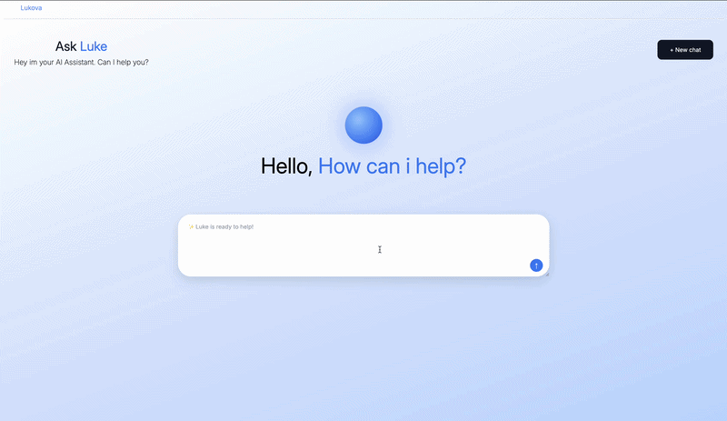

# Lukova

My own version of an AI chat assistant, built with plain HTML/CSS/JS and the Anthropic API. This was my 4th portfolio project.

## Live demo
https://lukemmanyi.github.io/lukes-ai-assistant/

Heads up — the live version won't actually chat since I'm not exposing my API key publicly. Check the gif below to see it actually working, or run it locally with your own key.

## Demo



## What it does
- Streams responses in real time (actual streaming with ReadableStream, not a fake typewriter effect)
- Renders markdown properly — bold, headers, lists all show up formatted
- Keeps your whole conversation on screen, styled like a real chat
- Textarea grows as you type
- New chat button to start over
- Shows an error message instead of just breaking if the API call fails
- Typing dots while it's thinking

## Built with
- HTML, CSS, JS — no frameworks
- Anthropic API (claude-haiku-4-5)
- marked.js for markdown

## Running it yourself
1. Clone this repo
2. Get an API key from console.anthropic.com
3. Make a `config.js` file in the root with:
```javascript
const API_KEY = "your-key-here";
```
4. Open index.html

config.js is gitignored so don't worry about accidentally leaking your key if you fork this.

## Notes
This was mostly about learning how to actually work with a streaming API instead of just doing a basic fetch — reading chunks manually with getReader(), parsing SSE data, handling errors when the stream fails partway through. Harder than my other 3 projects but the most fun to build.
